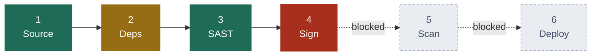
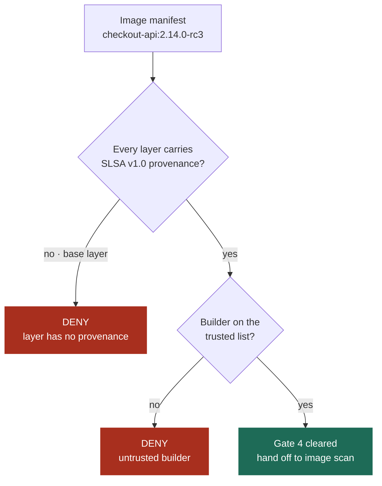
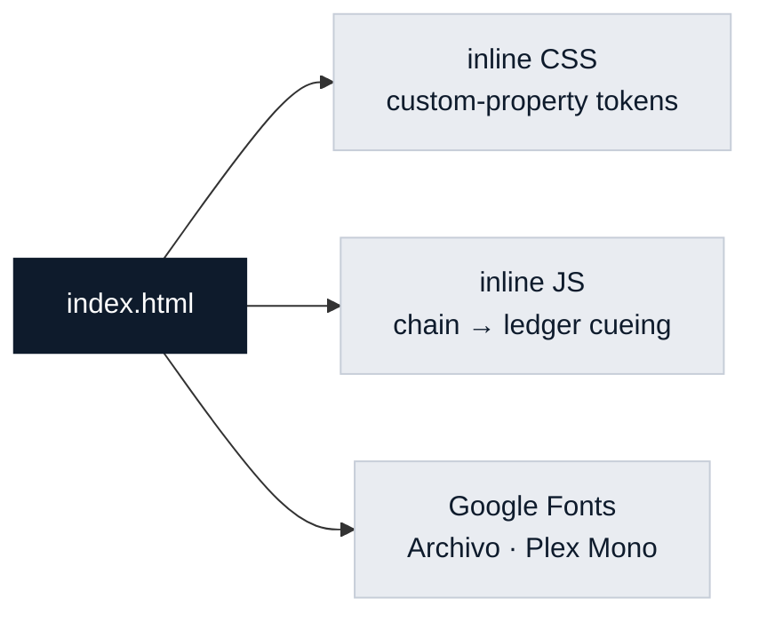

# Custodian

**A release-gate ledger.** One static page that answers a single question for a platform team: *can this artifact ship, and if not, which gate stopped it?*


---

## The pipeline it renders

Six gates, evaluated in order. A rejection stops everything downstream — gates 5 and 6 never run.



| # | Gate | Attested by | Elapsed | Result |
|---|------|-------------|---------|--------|
| 1 | Source integrity | `github-oidc` | 12s | 🟢 Cleared |
| 2 | Dependencies | `syft@1.19.0` | 41s | 🟡 Cleared with 1 warning |
| 3 | Static analysis | `appsec-bot` | 3m 12s | 🟢 Cleared |
| 4 | **Artifact signing** | `cosign / fulcio` | 8s | 🔴 **Rejected** |
| 5 | Image scan | waiting on gate 4 | — | ⚪ Not run |
| 6 | Admission control | waiting on gate 5 | — | ⚪ Not run |

---

## Why gate 4 said no

The rejection is not a severity score to argue with. A layer is either traceable to a trusted builder or it is not.



The offending layer is `docker.io/library/node:20-alpine`, pulled straight from Docker Hub. The fix is a rebuild against the mirrored base that ships attestations.

---

## Page layout

The hero is a stamped verdict, not a stat tile. Everything else is quiet around it.

```
┌────────────────────────────────────────────────────────────────┐
│ Custodian / checkout-api        build 4821 · release/2.14      │
├────────────────────────────────────────────────────────────────┤
│                                                                │
│  Release candidate                          ╭──────────────╮   │
│  HELD AT GATE 4                             │ ╭──────────╮ │   │
│                                             │ │  DENIED  │ │   │
│  Four of six gates cleared. Artifact        │ │ gate 4/6 │ │   │
│  signing rejected the build…                │ ╰──────────╯ │   │
│                                             ╰──────────────╯   │
│  Image    ghcr.io/northwind/checkout-api…      ↑ rotated seal,  │
│  Digest   sha256:9f2c4b7e0d51a83c…               lands on load  │
│  Commit   8e31c0d                                              │
│                                                                │
│  [ See what is blocking ]  [ Read the policy ]                 │
│                                                                │
│  ●────●────●────◉────○────○     ← click a node, jump to its    │
│  Src  Dep  SAST Sign Scan Dep      row in the ledger below     │
├────────────────────────────────────────────────────────────────┤
│  Chain of custody          ledger of 6 gates, who signed each  │
│  What is blocking          1 critical + 2 advisory findings    │
│  The rule that denied it   the rego policy, verbatim           │
└────────────────────────────────────────────────────────────────┘
```

---

## Design tokens

Cool paper and ink navy, with one stamp red carrying all the weight. Deliberately not the near-black-plus-neon-green look that every security dashboard defaults to.

| Swatch | Token | Light | Dark | Used for |
|---|---|---|---|---|
|  | `--paper` | `#e9ecf1` | `#0d131b` | page ground |
|  | `--ink` | `#0e1b2c` | `#e6ebf2` | headings, body |
|  | `--slate` | `#43526a` | `#95a4b8` | secondary text |
|  | `--seal` | `#a82f1e` | `#e4664f` | the stamp, rejections |
|  | `--pass` | `#1e6b57` | `#4fbf9c` | cleared gates |
|  | `--warn` | `#966c14` | `#dcaa48` | warnings |

**Type** — [Archivo](https://fonts.google.com/specimen/Archivo) throughout, tight tracking at display sizes. [IBM Plex Mono](https://fonts.google.com/specimen/IBM+Plex+Mono) *only* where the content is literally machine output: digests, image tags, CVE ids, file paths. Never for decorative labels.

```
  Display   Archivo 700   clamp(40px … 76px)   -0.035em
  Section   Archivo 600   24px                 -0.020em
  Body      Archivo 400   16px / 1.5           max 64ch
  Machine   Plex Mono 400 13.5px
```

---

## Structure

```
ProjectA/
├── index.html     the whole thing — markup, tokens, styles, 20 lines of JS
└── README.md      you are here
```

No build step, no framework, no bundler. Everything lives in one file because the page is one page.



---

## Run it

```bash
open index.html                  # macOS, straight from disk
python3 -m http.server 8000      # or serve it, then visit localhost:8000
```

The only network request is the font stylesheet; offline it falls back to the system sans and mono stacks.

---

## Interaction

| Action | What happens |
|---|---|
| Click a node in the gate chain | Scrolls to that gate's ledger row and cues it for 2.2s |
| **See what is blocking** | Jumps to the findings section |
| **Read the policy** | Jumps to the rego that produced the verdict |
| Page load | The seal lands once — scale and rotate settling into place |

Every control is a real `<button>`, reachable by keyboard with a visible focus ring. The stamp animation is the page's only non-user-triggered motion, and it is skipped entirely under `prefers-reduced-motion`.

---

## Quality floor

- ✅ Responsive to 320px — the ledger reflows, the chain keeps all six nodes
- ✅ Light and dark, driven by `prefers-color-scheme` off one token set
- ✅ Keyboard reachable with visible `:focus-visible` outlines
- ✅ `prefers-reduced-motion` respected
- ✅ Zero runtime dependencies

> **Note** — the build, digests, CVE ids and findings on the page are sample data for design review. They do not describe a real artifact.
